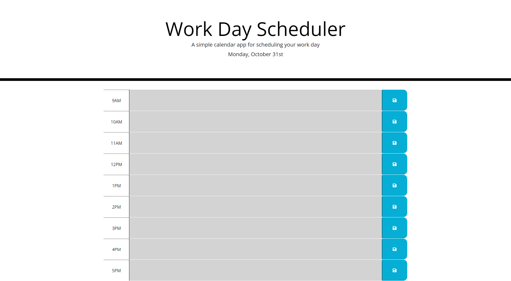

# John Kang, Challenge 5; Workday Planner 
The purpose of this assignment was to create a workday planner that can be used to plan out the users 9-5. The workday planner will store the events on to local storage as well as the webpage itself. The planner will sort the past, present, and future event in different colors so the user can easily see what events are past, what events are present and future events.

## Screenshot of Deployed Website

### Deployed Site URL
https://jyk33.github.io/work-day-scheduler/